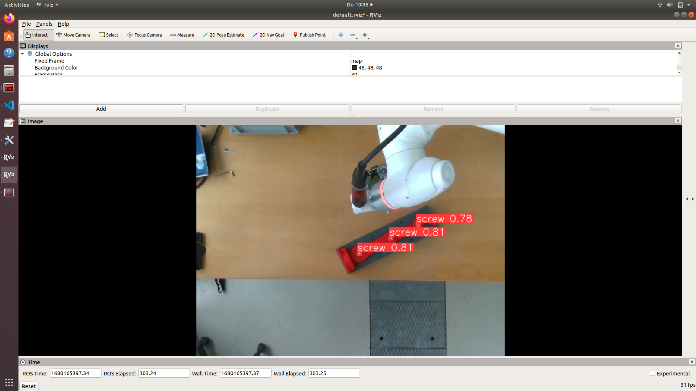

# CoboTrees – Screw Detection for Collaborative Assembly  

This project improves **screw detection using Computer Vision** in the **CoboTrees** collaborative assembly process. A neural network identifies screw positions for a robot to tighten them.  

## Example Detection  
  

## How to Run  

### 1. Install Dependencies  
```bash
pip install torch torchvision numpy opencv-python rospy
```

### 2. Ensure ROS is Installed and Sourced

```bash
source /opt/ros/noetic/setup.bash  # Adjust for your ROS version
```

## 3. Run the YOLOv5 Node

```bash
rosrun <your_package_name> yolov5_node.py
```

## 4. Publish an Image Topic (if not already running)

```bash
roslaunch <camera_package> <launch_file>
```

## 5. View Results

```text
- Processed image topic: /yolov5_node/visualization
- Detected screw coordinates: /yolov5_node/result